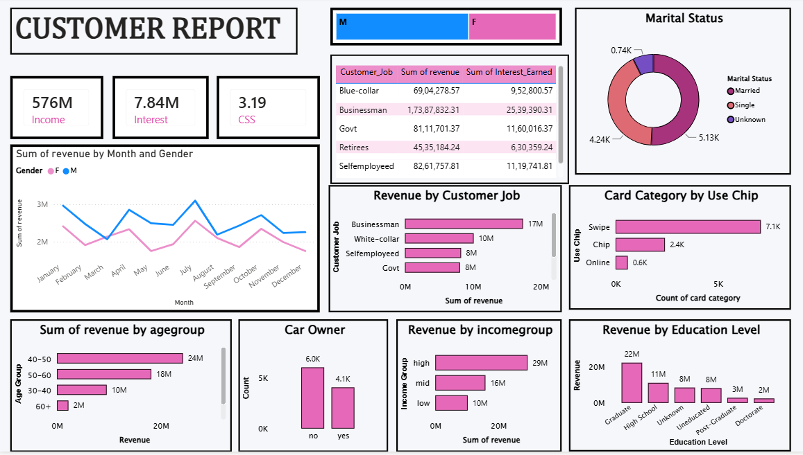
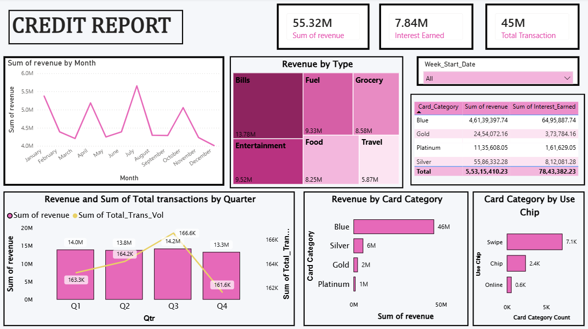

# 💳 Credit Card Financial Dashboard | Power BI & MySQL

An interactive **Power BI dashboard** built using **credit card transaction and customer datasets**. The project demonstrates an end-to-end Business Intelligence workflow by importing CSV data into **MySQL**, connecting **Power BI** to the database, and creating interactive dashboards for customer and credit card analytics.

---

## 🚀 Project Overview

This project analyzes customer demographics, credit card usage, revenue, transactions, and interest earned to provide meaningful business insights for financial decision-making.

**Workflow:**

CSV Dataset → MySQL Database → Power BI → Interactive Dashboard

---

## 🛠 Tech Stack

- Power BI Desktop
- MySQL
- SQL
- Power Query
- DAX
- CSV Dataset

---

## 📊 Dashboard Features

### Customer Report

- Revenue Analysis
- Interest Earned
- Customer Satisfaction Score (CSS)
- Revenue by Gender
- Revenue by Customer Job
- Revenue by Age Group
- Revenue by Income Group
- Revenue by Education Level
- Card Usage Analysis
- Marital Status Distribution

---

### Credit Card Report

- Revenue by Card Category
- Revenue by Expense Type
- Interest Earned Analysis
- Monthly Revenue Trend
- Quarterly Revenue vs Transactions
- Card Usage Analysis
- Weekly Date Filter
- Revenue Summary by Card Category

---

## 📂 Dataset

The project uses two related datasets:

- **Customer Data**
- **Credit Card Transaction Data**

The datasets were first imported into **MySQL**, then connected to **Power BI** for visualization and analysis.

---

## 📷 Dashboard Preview

### Customer Report



---

### Credit Card Report



---

## 📁 Project Structure

```text
Credit-Card-Financial-Dashboard/
│
├── Credit_Card_Dashboard.pbix
├── credit_card_project_customer.csv
├── credit_card_project_credit_card.csv
├── Credit_Card_Dashboard.pdf
├── Images/
│   ├── Customer_report.png
│   └── Credit_report.png
├── mysql_queries.sql
└── README.md
```

---

## 📌 Key Highlights

- Imported CSV datasets into MySQL.
- Connected Power BI directly to the MySQL database.
- Built an interactive dashboard using Power Query and DAX.
- Created customer and credit card analytics dashboards.
- Visualized revenue, transactions, customer demographics, and card usage patterns.
- Implemented slicers and interactive filtering for better business analysis.

---

## 💡 Skills Demonstrated

- Business Intelligence
- Power BI Dashboard Development
- SQL & MySQL
- Data Modeling
- Data Transformation
- Power Query
- DAX
- Data Visualization
- Financial Analytics

---

## 👩‍💻 Author

**Riya S Menon**

B.Tech CSE (AI & ML)

